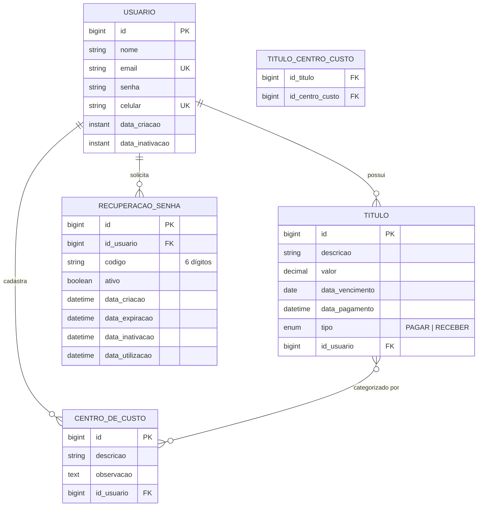

# 💰 Certus Controle Financeiro — Back-end

#### *API REST para gestão financeira pessoal e corporativa*

[](https://openjdk.org/projects/jdk/17/)
[](https://spring.io/projects/spring-boot)
[](https://www.postgresql.org/)
[](https://www.docker.com/)
[](https://jwt.io/)

[]()
[]()
[]()

---

## ✨ Sobre o projeto

**Certus Controle Financeiro** é uma plataforma de gestão financeira que centraliza o controle de **títulos a pagar e a receber**, **centros de custo** e oferece um **dashboard consolidado** com a saúde financeira do usuário.

Este repositório contém a **API REST** que sustenta toda a aplicação — autenticação, regras de negócio, persistência e exposição dos endpoints consumidos pelo front-end.

> 🎨 O front-end React + TypeScript vive em [**Certus_ControleFinanceiro_FrontEnd**](https://github.com/jefti/Certus_ControleFinanceiro_FrontEnd).

---

## 📑 Sumário

- [Funcionalidades](#-funcionalidades)
- [Stack & Tecnologias](#-stack--tecnologias)
- [Arquitetura](#-arquitetura)
- [Modelagem de Dados](#-modelagem-de-dados)
- [Pré-requisitos](#-pré-requisitos)
- [Configuração](#-configuração)
- [Execução Local](#-execução-local)
- [Execução com Docker Compose](#-execução-com-docker-compose)
- [Observabilidade](#-observabilidade)
- [Documentação da API](#-documentação-da-api)
- [Deploy](#-deploy)
- [Autores](#-autores)

---

## 🚀 Funcionalidades

| Domínio | Recursos |
| --- | --- |
| 🔐 **Autenticação** | Login com JWT, recuperação de senha por e-mail, expiração configurável |
| 👤 **Usuários** | Cadastro, atualização, inativação lógica, perfil autenticado |
| 💵 **Títulos** | CRUD de títulos a pagar/receber, controle de vencimento e pagamento |
| 🏷️ **Centros de Custo** | Categorização de títulos (N:N), observações livres |
| 📊 **Dashboard** | Indicadores financeiros consolidados por usuário |
| 📖 **Documentação** | Swagger UI / OpenAPI 3 interativo |

---

## 🧰 Stack & Tecnologias

| Camada | Tecnologias |
| :---: | :--- |
| **Linguagem** | Java 17 |
| **Framework** | Spring Boot 3.5 — Web, Data JPA, Security, Actuator, DevTools |
| **Segurança** | Spring Security 6 · JWT (jjwt 0.13) · BCrypt |
| **Persistência** | PostgreSQL 16 · Hibernate · **Flyway** (migrations versionadas) |
| **Mapeamento** | ModelMapper · Lombok |
| **E-mail** | Resend API (templates transacionais) |
| **Documentação** | Springdoc OpenAPI · Swagger UI |
| **Observabilidade** | Spring Actuator · Micrometer · **Prometheus** · **Grafana** |
| **Build & Qualidade** | Maven · JaCoCo (cobertura) |
| **Containerização** | Docker · Docker Compose |
| **Configuração** | spring-dotenv (`.env`) |

### 📦 Principais dependências

```xml
spring-boot-starter-web          ┃ spring-boot-starter-data-jpa
spring-boot-starter-security     ┃ spring-boot-starter-actuator
flyway-core / flyway-postgresql  ┃ postgresql
jjwt-api / jjwt-impl / jjwt-gson ┃ micrometer-registry-prometheus
springdoc-openapi-starter-webmvc ┃ modelmapper
spring-dotenv                    ┃ lombok
```

---

## 🏛️ Arquitetura

API estruturada em **camadas**, com responsabilidades claramente separadas e contratos bem definidos entre elas:

```
src/main/java/com/projeto/financeiro
├── 🎯 controller     → Endpoints REST e contratos HTTP
├── ⚙️  service        → Regras de negócio
├── 💾 repository     → Acesso a dados (Spring Data JPA)
├── 🧱 entity         → Modelo de domínio (JPA / Hibernate)
├── 🔁 dto            → Requests, responses e mappers
├── 🛡️  security       → Filtros JWT, configurações Spring Security, OpenAPI
├── ❗ exception      → Exceções de negócio tipadas
├── 🧯 handler        → Tratamento global de erros (RFC 7807)
└── 🚀 FinanceiroApplication.java
```

### 🔐 Fluxo de autenticação

```
Cliente ──► /auth/login ──► AuthController
                              │
                              ▼
                       AuthenticationManager (Spring Security)
                              │
                              ▼
                       UserDetailsSecurityServer ──► UsuarioRepository
                              │
                              ▼
                          JWT (jjwt) ──► LoginResponse
                              
Cliente ──► /api/** (Bearer) ──► JwtAuthorizationFilter ──► Controller
```

---

## 🗂️ Modelagem de Dados

Diagrama Entidade-Relacionamento das tabelas principais:



> 💡 **Multitenant por usuário:** todo recurso (título, centro de custo) é **escopado pelo usuário autenticado**, garantido pela camada de serviço via `AuthenticatedUserProvider`.

---

## ✅ Pré-requisitos

- ☕ **Java 17+**
- 📦 **Maven 3.8+**
- 🐘 **PostgreSQL 13+** *(ou Docker, para usar o Compose)*
- 🐳 **Docker & Docker Compose** *(opcional, recomendado)*

---

## ⚙️ Configuração

Crie um arquivo **`.env`** na raiz do projeto a partir do template fornecido:

```bash
cp .env.example .env
```

Em seguida, preencha os valores reais (banco de dados, segredo JWT, credenciais do provedor de e-mail, tempo de expiração da recuperação de senha).

> 🔒 O arquivo `.env` **não é versionado**. Consulte o **[`.env.example`](./.env.example)** para a lista completa de variáveis e seus formatos esperados.
> Em produção, prefira injetar as variáveis pelo orquestrador (Render, Kubernetes, ECS, etc.) em vez de manter um arquivo no servidor.

---

## ▶️ Execução Local

```bash
# Compilar e instalar dependências
mvn clean install

# Subir a aplicação
mvn spring-boot:run
```

A API ficará disponível em **http://localhost:8080**.

> A porta pode ser sobrescrita pela variável `PORT` (útil em provedores de deploy gerenciado).

---

## 🐳 Execução com Docker Compose

O `docker-compose.yml` provisiona toda a stack: **API + PostgreSQL + Prometheus + Grafana**.

```bash
docker compose up --build
```

| Serviço      | URL                            | Credenciais        |
| ------------ | ------------------------------ | ------------------ |
| 🚀 API        | http://localhost:8080          | —                  |
| 🐘 PostgreSQL | `localhost:5432` (db `certus`) | via `.env`         |
| 📈 Prometheus | http://localhost:9090          | —                  |
| 📊 Grafana    | http://localhost:3000          | `admin` / `admin`  |

Para construir e rodar **apenas** a imagem da aplicação:

```bash
docker build -t certus-financeiro-backend .
docker run --env-file .env -p 8080:8080 certus-financeiro-backend
```

---

## 📡 Observabilidade

Endpoints expostos pelo **Spring Boot Actuator**:

| Endpoint | Descrição |
| --- | --- |
| `GET /actuator/health` | Health check da aplicação |
| `GET /actuator/info` | Metadados de build |
| `GET /actuator/prometheus` | Métricas no formato Prometheus |

As métricas são coletadas pelo Prometheus (`monitoring/prometheus/prometheus.yml`) e podem ser exploradas no Grafana já provisionado pelo Compose.

---

## 📖 Documentação da API

Após subir a aplicação, a documentação interativa fica disponível em:

- 🧪 **Swagger UI:** http://localhost:8080/swagger-ui.html
- 📜 **OpenAPI JSON:** http://localhost:8080/v3/api-docs

**Grupos de endpoints:**

`Autenticação` · `Usuários` · `Títulos` · `Centros de Custo` · `Dashboard`

---

## ☁️ Deploy

O projeto inclui um **`render.yaml`** pronto para deploy no [Render](https://render.com/).
Em qualquer provedor, basta configurar as variáveis listadas em [`.env.example`](./.env.example) com os valores reais.

---

## 👥 Autores

<div align="center">

| [<br/><sub><b>Marcelo Pinotti</b></sub>](https://github.com/marcelopinotti) | [<br/><sub><b>Jefti Meira</b></sub>](https://github.com/jefti) |
| :---: | :---: |
| Back-end | Full-stack |

</div>

---


*Feito com ☕ e Spring Boot.*

